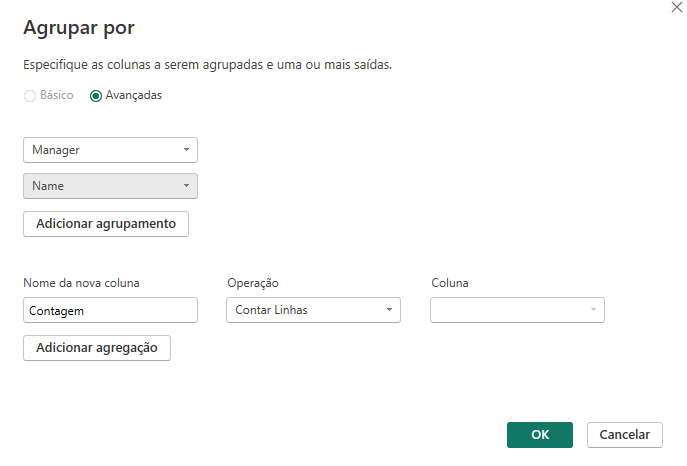

# Desafio 2 - Processando e Transformando dados com o Power BI

Após a criação do banco os dados MySQL, foi feita a integração ao Power BI.

>1.	Foi verificada a consistência dos tipos de dados, uma vez que o Power BI nem sempre sugere a melhor opção.

>2.	Os valores monetários foram modificados para o tipo double preciso.

>3.	A existência de nulos foi verificada e tratados.

>4.	A coluna complexa **address** localizada na tabela **employee** foi dividida, a divisão foi realizada usando como delimitador o caractere "-" e após a divisão as colunas foram renomeadas para **number, street, city e state.**

**Coluna antes da divisão**

**Colunas após a divisão**

>5.	Foi realizada a mescla de consultas entre as tabelas employee e departament para criação de uma nova tabela employee com o nome dos departamentos associados aos colaboradores. A mescla teve como base a tabela employee utilizando-se os campos Dno e Dnumber como referência.

**Parâmetros da Mescla de Consultas**

**Resultado da Mescla de Consultas**

>6.	Foi realizada a junção dos colaboradores e respectivos nomes dos gerentes. A junção foi realizada no Power BI e Utilizou-se a tabela employee para criação da mescla de tabelas. A mesma tabela foi utilizada para obter a junção fazendo a ligação de Super_Ssn com Ssn.

**Resultado da Mescla de Consultas**

>7.	As colunas de Nome e Sobrenome foram mescladas para ter apenas uma coluna definindo o nome dos colaboradores. Foi utilizada a opção de mesclar colunas com o sperador espaço selecionado, após a mescla a coluna foi renomeada para Name.

>8.	Foi criada uma nova mescla de consultas entre as tabelas departament e dept_locations utilizando as colunas Dnumber como parâmetro, a tabela gerada gerada foi renomeada para dept_namelocation, as colunas desnecessárias e duplicadas foram removidas e a mescla de colunas entre as colunas Dname e Dlocation foi realizada.

**Resultado da Mescla de Consultas**

>9.	No passo anterior foi utilizada a opção mesclar consultas e não a opção acrescentarm pois há uma coluna em comum que combina as duas consultas. 

>10. Foi realizado o agrupamento das colunas Manager e employee a fim de saber quantos colaboradores existem por gerente.  

**Parâmetros do Agrupamento de Colunas**

**Resultado do Agrupamento de Colunas**

## Testando os Dados

Após a transformação dos dados proposta, os mesmos foram testados utilizando alguns visuais do Power BI conforme imagem abaixo:

